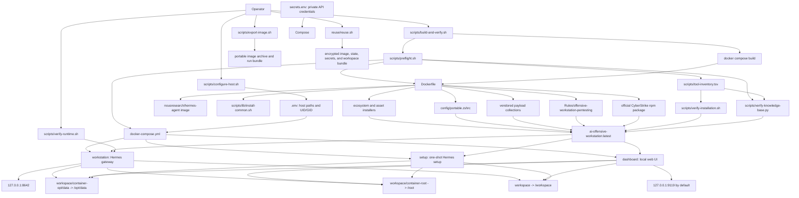

# AI Offensive Workstation Project Map

This document is the pre-revamp architecture baseline for the repository as of
2026-07-28. It maps the tracked source tree, build and runtime flows, ownership
boundaries, validation gates, and the main design constraints that should remain
connected during the revamp.

## System Purpose

The repository builds and operates a persistent Docker workstation that layers
an offensive-security toolchain, CyberStrike, local security knowledge, browser
automation, and a shared Zsh environment on top of the Hermes Agent image.

The project has four distinct kinds of content:

1. First-party orchestration: Docker, Compose, installers, verification scripts,
   host configuration, export/migration scripts, and documentation.
2. Runtime knowledge: the Hermes skill, generated tool guides, safety rules,
   workflows, and the bundled CyberStrike documentation router.
3. Vendored security assets: `PayloadsAllTheThings/` and `payload-box/`.
4. Host-only state: `.env`, `secrets.env`, scan output, and `workspace/`. These
   are deliberately ignored and are not part of the portable source snapshot.

## Architecture Graph

## Repository Map

| Path | Responsibility | Connected to |
| --- | --- | --- |
| `Dockerfile` | Defines the immutable workstation image and build order. | Every installer, payload sources, Zsh config, inventory, and bundled skill. |
| `docker-compose.yml` | Defines build inputs and the workstation, dashboard, and setup services. | `.env`, optional `secrets.env`, the image, and the three persistent mounts. |
| `scripts/lib/install-common.sh` | Shared retry, clone, download, version-recording, and install helpers. | Sourced by ecosystem installers. |
| `scripts/install-*.sh` | Installs system, network, Go, Python, Node, Rust, Ruby, binary, source, compatibility, asset, browser, CyberStrike, Zsh, and permission components. | Called in a deliberate order by the `Dockerfile`. |
| `scripts/tool-inventory.tsv` | Authoritative runtime contract for required commands, paths, and capabilities. | Preflight, image verification, healthcheck, build verification, knowledge verification. |
| `scripts/preflight.sh` | Safe source/linkage validation before a build. | Compose, ignore rules, secrets hygiene, installers, inventory, and knowledge base. |
| `scripts/build-and-verify.sh` | Recommended build entry point and post-build image audit. | Preflight, Compose, installed tool checker, knowledge checker, Python checks. |
| `scripts/verify-runtime.sh` | Audits the running Compose stack and optional reuse round trip. | Workstation services, mounts, image tools, and persistence. |
| `scripts/verify-installation.sh` | Verifies installed inventory items and writes a resolved manifest. | Inventory and Docker healthcheck. |
| `scripts/verify-knowledge-base.py` | Enforces guide metadata, inventory coverage, workflow coverage, CyberStrike source completeness, links, and optional CLI-help snapshots. | Inventory and bundled Hermes skill. |
| `scripts/generate-rules.py` | Regenerates the structured Hermes tool/reference knowledge from the inventory and installer definitions. | Inventory, installers, and `Rules/`. |
| `scripts/generate-help-reference.sh` | Captures installed command help inside the image. | Tool inventory and `Rules/.../references/cli-help/`. |
| `scripts/configure-host.sh` | Creates machine-local Compose settings and persistent directories. | `.env` and `workspace/`. |
| `scripts/configure-secrets.sh` | Projects approved API credentials into tool-specific runtime configuration. | `secrets.env`, `/root`, and `/opt/data`. |
| `scripts/migrate-container-root.sh` | Preserves useful root state from an older container layout. | Docker container state and `workspace/container-root`. |
| `scripts/export-image.sh` | Produces an image archive plus offline runtime files. | Built image and `run_exported_image.md`. |
| `reuse/reuse.sh` | Encrypts or restores a complete authenticated workstation bundle. | Image, persistent state, secrets, and workspace. |
| `config/portable.zshrc` | Shared interactive shell behavior, prompt, aliases, history, and plugins. | Installed by `scripts/install-zsh.sh`. |
| `config/tool-aliases.zsh` | Compatibility aliases for installed tools. | Sourced by the portable Zsh configuration. |
| `config/excluded-tools.txt` | Documents deliberately excluded tools. | Copied into the image security manifest. |
| `Rules/offensive-workstation-pentesting/` | Bundled Hermes offensive-security skill and its local retrieval corpus. | Copied into the image and checked against the inventory. |
| `Rules/.../references/cyberstrike/` | Concise CyberStrike router plus a 71-file upstream documentation snapshot. | Hermes local retrieval and CyberStrike operation. |
| `PayloadsAllTheThings/` | Vendored payload and technique collection. | Copied by `scripts/install-assets.sh` into image-owned assets. |
| `payload-box/` | Vendored payload-box collections. | Copied by `scripts/install-assets.sh` into image-owned assets. |
| `.github/workflows/validate.yml` | CI source validation and secret scanning. | Preflight, reuse validation, Zsh syntax, and Gitleaks. |
| `README.md`, `command.md`, `how_it_works.md` | User setup, command reference, and architecture documentation. | Describe the same build/runtime interfaces exposed by scripts and Compose. |

## Build Order and Contracts

The `Dockerfile` intentionally installs lower-level dependencies before tools
that consume them:

1. System packages and shared installer helpers.
2. Zsh and network utilities.
3. Go, Python, Node, Rust, and Ruby toolchains.
4. Prebuilt and source-built security tools.
5. Compatibility wrappers and aliases.
6. Vendored payload assets.
7. Browser automation and CyberStrike.
8. The authoritative inventory, Hermes skill, generated help, runtime
   permissions, and strict final verification.

The image is considered valid only when the inventory and knowledge base agree
with what the installers produced. `scripts/tool-inventory.tsv` is therefore
the central contract: changing an installed tool should normally update its
installer, inventory row, guide, and any relevant documentation together.

## Runtime Ownership Boundaries

| Location | Owner/lifecycle | Persistence |
| --- | --- | --- |
| `/opt/hermes`, `/opt/security-tools`, `/opt/security-assets`, `/opt/toolchains` | Built image | Replaced on image rebuild |
| `/opt/data` | `workspace/container-opt/data` | Persistent host state |
| `/root` | `workspace/container-root` | Persistent root/tool state |
| `/workspace` | `workspace/` | Persistent projects, targets, reports, and notes |
| `.env` | Local host configuration | Ignored by Git and Docker build context |
| `secrets.env` | Local credentials | Ignored by Git and Docker build context; expected mode `0600` |

The separation is important. Mounting host storage over all of `/opt` would hide
the image-owned Hermes installation, tools, and assets.

## Validation Baseline

The following source checks passed on 2026-07-28:

- All 21 `scripts/preflight.sh` checks.
- Bash syntax for all first-party shell scripts and `reuse/reuse.sh`.
- Zsh syntax for `config/portable.zshrc`.
- `docker compose config --quiet`.
- Knowledge validation without installed-help enforcement: 137 primary guides,
  25 compatibility aliases, and 15 workflows covering 194 inventory checks.
- The CyberStrike local source library contains the required 71 files.

`python3 scripts/verify-knowledge-base.py --require-help` does not pass in a
source-only checkout because `Rules/.../references/cli-help/` is generated from
the commands installed in the built image. The managed Docker build runs the
help generator before enforcing this stronger check. This is a lifecycle
dependency, not evidence that the source graph is disconnected.

## Revamp Constraints and Opportunities

The current design is logically connected, but these constraints should be made
explicit during the revamp:

- Reproducibility is optional rather than automatic: the Hermes base defaults
  to `latest`, Rust defaults to `stable`, and CyberStrike resolves its current
  npm release during managed builds. Pinning inputs would make historical
  rebuilds deterministic.
- `privileged: true` is intentional for an offensive workstation but creates a
  broad trust boundary. Keep the localhost-only gateway/dashboard bindings and
  document any future reduction in privileges per tool.
- Generated installed-help pages exist only after image construction. A revamp
  could make source-only and image-only validation modes more visibly distinct.
- The payload collections are vendored snapshots. Record their upstream commit
  identifiers when refreshing them so asset provenance is auditable.
- `README.md` is comprehensive but very large. Preserve a short onboarding path
  and move detailed maintenance, architecture, and troubleshooting material
  into focused documents with one canonical command source.

## Safe Revamp Sequence

1. Preserve this snapshot branch and tag or record its commit.
2. Keep inventory, installer, guide, and documentation changes atomic.
3. Refactor documentation and repository layout before changing runtime
   behavior.
4. Refactor build stages while retaining the existing verification gates.
5. Reduce mutable versions and privilege only after proving compatibility.
6. Run preflight for every change and a clean image build plus runtime audit at
   each architectural milestone.
