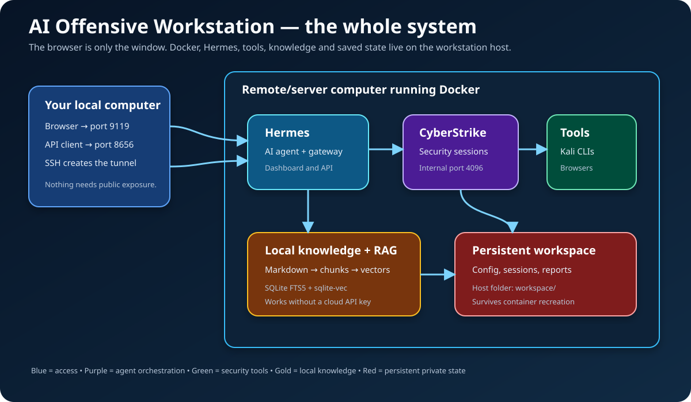

# 🛡️ AI Offensive Workstation

> A complete Kali Linux security workstation where an AI agent can explain tools, search local knowledge, organize evidence, automate a browser, and coordinate authorized testing.

[](https://www.kali.org/)
[](https://www.docker.com/)
[](https://github.com/NousResearch/hermes-agent)
[](#safety-first)



## Start here

You do **not** need to understand Docker, AI agents, RAG, or Kali before beginning. Pick the path that matches you:

| I want to… | Read this |
|---|---|
| Install it for the first time | [Beginner guide](docs/BEGINNERS_GUIDE.md) |
| Understand what happens behind the scenes | [How it works](docs/HOW_IT_WORKS.md) |
| Understand every service, folder and connection | [Architecture](docs/ARCHITECTURE.md) |
| Understand Hermes, API keys, CyberStrike and vector RAG | [Hermes, APIs and RAG deep dive](docs/HERMES_RAG_API.md) |
| Find the correct command | [Command cookbook](docs/COMMANDS.md) |
| Move it to another computer | [Backup and migration](docs/REUSE.md) |
| Check whether everything is healthy | [Implementation and verification](docs/IMPLEMENTATION_AUDIT.md) |

## What is this gini?

A normal Kali installation gives you hundreds of security programs. The hard part is knowing which one to use, which options are safe, where to store results, and how to turn raw scanner output into verified findings.

This project adds an organized layer around Kali:

- **Docker** places the workstation inside a repeatable container so it does not scatter tools across your host computer.
- **Hermes Agent** is the main assistant. It can reason about a task, use tools, search the local knowledge base, remember useful context, and expose a dashboard and API.
- **CyberStrike** is a specialist security-agent service that Hermes can control through nine local MCP tools.
- **RAG** lets Hermes search documentation stored on the workstation before answering. It is like giving the agent an indexed private library.
- **The workspace** keeps projects, evidence, configuration and agent state outside the replaceable container.

> [!IMPORTANT]
> An AI suggestion or scanner result is not automatically correct. Review commands before running them and manually verify findings.

## Ten-minute quick start

### 1. Install the prerequisites

You need a Linux computer or server with:

- Git
- Docker Engine
- Docker Compose v2 (`docker compose`, not the old `docker-compose` command)
- approximately 80–120 GB of free disk space for the image, caches and assets
- enough memory for browsers and AI tools; 8 GB is a practical minimum

Confirm the basics:

```bash
git --version
docker --version
docker compose version
```

### 2. Download the project

Clone the `main` branch from GitHub, then enter the new project directory:

```bash
git clone --branch main https://github.com/mahfuz33R/ai-offensive-workstation.git
cd ai-offensive-workstation
```

Every command in the rest of this quick start is run from that directory. If you
already cloned the project, update it instead:

```bash
cd ai-offensive-workstation
git pull --ff-only origin main
```

### 3. Prepare private configuration

From the repository directory:

```bash
bash scripts/configure-host.sh
chmod 600 .env
```

This creates:

- `.env`, the private configuration and credential file;
- `workspace/`, the persistent working area;
- a random `API_SERVER_KEY` protecting the Hermes HTTP API.

Edit `.env` and add the key for the model provider you intend to use, such as
OpenAI, Anthropic, Google, OpenRouter or Groq:

```bash
nano .env
```

For example, an OpenAI user would change only this line:

```dotenv
OPENAI_API_KEY=your-real-provider-key
```

Keep unused provider lines empty. Do not put spaces around `=` and do not put
quotes around the key. Save the file, then protect it again:

```bash
chmod 600 .env
```

RAG search, API health, session storage and `no_reply=true` CyberStrike messages
work without a provider key. AI-generated replies need at least one configured
model provider.

### 4. Check the source

```bash
bash scripts/preflight.sh
```

This does not build or start Docker. It checks configuration safety, shell/Python syntax, Compose architecture, inventory structure and knowledge links.

### 5. Build and verify the image

```bash
bash scripts/build-and-verify.sh
```

> [!IMPORTANT]
> A complete first-time Docker build and verification, followed by Compose
> startup, can take approximately **6–9 hours**. The exact time depends on CPU,
> disk performance and download speed. The build downloads Kali packages,
> browsers, security tools, templates, wordlists and local embedding models. Do
> not interrupt it while it is still producing output or using CPU/disk.

The build intentionally fails if a required item cannot be installed or
launched. Later builds are normally faster when Docker can reuse completed
layers.

If a previous build stopped after many successful layers, reuse its cache:

```bash
bash scripts/build-and-verify.sh --cached
```

### 6. Configure Hermes

After the image has been built, run Hermes's interactive setup container:

```bash
sudo docker compose --profile setup run --rm setup
```

Follow the on-screen questions to select your model provider and model. The exact
choices can change between Hermes releases. Use the same provider whose key you
put in `.env`. Setup data is saved under
`workspace/container-opt/data/`, so it survives container replacement and
computer restarts.

These three secrets have different jobs:

| Secret | What it allows | Where it is used |
|---|---|---|
| Provider key, such as `OPENAI_API_KEY` | Hermes calls an AI model | `.env` and Hermes setup |
| `API_SERVER_KEY` | An API client calls the Hermes gateway | `Authorization: Bearer ...` on port `8656` |
| `CYBERSTRIKE_SERVER_PASSWORD` | Protects the internal CyberStrike service when explicitly set | Internal port `4096` |

They are not interchangeable. `scripts/configure-host.sh` creates
`API_SERVER_KEY` automatically; do not paste that value into a provider-key
field.

If setup is interrupted, run the same setup command again. To change provider or
model later, rerun it. If you edit `.env` after services are already running,
apply the new values with:

```bash
sudo docker compose up -d --no-build --force-recreate
```

For screenshots-in-words explanations of providers, persistence, the gateway,
RAG and authentication, read the [Hermes, RAG and API guide](docs/HERMES_RAG_API.md).

### 7. Start and verify the workstation

```bash
sudo docker compose up -d --no-build
sudo docker compose ps
```

Confirm Hermes, its pentesting skill, CyberStrike and both knowledge databases:

```bash
sudo docker compose exec workstation hermes version
sudo docker compose exec workstation env COLUMNS=240 hermes skills list
sudo docker compose exec workstation hermes mcp test cyberstrike
sudo docker compose exec workstation workstation-kb verify
sudo docker compose exec workstation cyberstrike-kb verify
```

Open the dashboard on the same computer:

```text
http://127.0.0.1:9119
```

Open a workstation shell:

```bash
sudo docker compose exec workstation zsh
```

Stop it without deleting persistent data:

```bash
sudo docker compose down
```

## Restarting Hermes correctly

> [!WARNING]
> Do not run `hermes gateway start`, `hermes gateway stop` or
> `hermes gateway restart` inside this workstation container. Docker Compose
> owns the foreground gateway process. Stopping it from inside exits the
> container and can leave persistent runtime markers that cause a restart loop.
> The dashboard's **Restart Gateway** button invokes the same unsupported
> in-container command. Do not use that button in this project. It can start a
> second gateway that fails with `Port 8656 already in use` even while the
> original gateway is healthy.

Restart the complete three-service stack from the **host repository directory**:

```bash
sudo docker compose restart workstation dashboard cyberstrike-api
sudo docker compose ps
```

If `docker compose ps` shows `Restarting`, perform the safe recovery below. It
preserves configuration, keys, sessions, reports and RAG databases; only the
gateway's disposable PID and lock markers are removed:

```bash
sudo docker compose logs --no-color --tail=200 workstation dashboard \
  > /tmp/ai-offensive-workstation-restart.log
sudo docker compose down

sudo rm -f -- \
  workspace/container-opt/data/gateway.pid \
  workspace/container-opt/data/gateway.lock

hermes_uid="$(sed -n 's/^HERMES_UID=//p' .env | tail -n1)"
hermes_gid="$(sed -n 's/^HERMES_GID=//p' .env | tail -n1)"
sudo chown -R "${hermes_uid}:${hermes_gid}" workspace/container-opt/data
sudo chmod 750 workspace/container-opt/data
sudo chmod 600 workspace/container-opt/data/.env

sudo docker compose up -d --no-build --force-recreate
sudo docker compose ps
sudo docker compose logs --tail=80 workstation dashboard
```

The hardened entrypoint also clears those two stale markers automatically on
the next foreground gateway start. See the [full troubleshooting cookbook](docs/COMMANDS.md#recover-a-hermes-gateway-restart-loop).

## Using a remote server

The dashboard and API deliberately listen only on the server's loopback interface. From your local computer, create an SSH tunnel:

```bash
ssh -N \
  -L 9119:127.0.0.1:9119 \
  -L 8656:127.0.0.1:8656 \
  USER@SERVER_IP
```

Keep that terminal open. On your local computer:

- browse to `http://127.0.0.1:9119` for the dashboard;
- send authenticated API requests to `http://127.0.0.1:8656/v1`.

Opening `/v1/models` directly in a browser normally returns `Invalid gateway API key`. That is correct: a browser address bar does not send an `Authorization: Bearer ...` header. See [Ports and authentication](docs/HERMES_RAG_API.md#part-7-ports-tunnels-and-authentication).

## Your first safe session

Inside the workstation shell:

```bash
export ENGAGEMENT=my-owned-lab
export OUTPUT_DIR="/workspace/reports/$ENGAGEMENT"
mkdir -p "$OUTPUT_DIR"/{raw,normalized,evidence,final}

workstation-kb search \
  "beginner workflow for an authorized local web application" \
  --limit 5
```

Then open the dashboard and tell Hermes:

```text
I own the test application at http://example.test. I authorize only passive
inspection and low-rate HTTP discovery. Do not exploit, brute-force, modify
data, or contact third parties. Explain every command before running it and
save results under /workspace/reports/my-owned-lab.
```

Good prompts contain the exact target, authorization, allowed actions, prohibited actions, rate limit, evidence location and stop conditions.

## Where your files go

| Location | Meaning | Persistent? |
|---|---|---:|
| `workspace/projects/` | Source code and engagement projects | ✅ |
| `workspace/targets/` | Explicitly authorized target lists | ✅ |
| `workspace/reports/` | Raw output, evidence and final reports | ✅ |
| `workspace/notes/` | Operator notes | ✅ |
| `workspace/container-opt/data/` | Hermes config, memory, RAG databases and CyberStrike state | ✅ |
| `workspace/container-root/` | Container root's home | ✅ |
| `/opt/security-tools` inside the container | Installed tools | Rebuilt with image |
| `/opt/security-assets` inside the container | Wordlists, templates and payloads | Rebuilt with image |

The container is replaceable. The `workspace/` directory is the part you protect and back up.

## What is installed?

The authoritative contract is [`scripts/manifests/tool-inventory.tsv`](scripts/manifests/tool-inventory.tsv). It currently covers commands, paths, Linux capabilities and substantive assets, including:

- Kali's `kali-linux-headless` toolset;
- Go, Python, Rust, Ruby, Node.js and npm;
- Nmap, Nuclei, httpx, ffuf, SQLMap, WPScan and many focused utilities;
- Chromium, Firefox, Playwright and agent-browser;
- SecLists, Nuclei templates, GF patterns and bundled payload repositories;
- Hermes, CyberStrike and both local RAG indexes.

Use `check-tools` rather than assuming a command exists.

## Safety first

This workstation is for systems and data you own or have explicit written authorization to test.

Never infer permission from a public IP, a URL, a bug-bounty program name, or the fact that a tool can reach a target. Start passive and low-rate. Do not perform denial of service, persistence, destructive modification, credential attacks, unrelated data extraction, lateral movement or third-party testing.

Read the full operating policy in [`SAFETY.md`](knowledge/skills/offensive-workstation-pentesting/references/SAFETY.md).

## Documentation map

| Document | Purpose |
|---|---|
| [Beginner guide](docs/BEGINNERS_GUIDE.md) | First-principles introduction and daily workflow |
| [Architecture](docs/ARCHITECTURE.md) | Services, files, networks, trust boundaries and diagrams |
| [How it works](docs/HOW_IT_WORKS.md) | Build, startup and request lifecycles |
| [Hermes, APIs and RAG](docs/HERMES_RAG_API.md) | Deep explanation and customization guide |
| [Commands](docs/COMMANDS.md) | Copy-paste operator cookbook |
| [Reuse](docs/REUSE.md) | Encrypted backup and machine migration |
| [Exported image](docs/EXPORTED_IMAGE.md) | Public/offline image without private state |
| [Implementation audit](docs/IMPLEMENTATION_AUDIT.md) | Verification layers and guarantees |
| [Third-party notices](docs/THIRD_PARTY_NOTICES.md) | Upstream software and licenses |

## One rule to remember

> **Dashboard on 9119, authenticated API on 8656, CyberStrike internal on 4096, and all valuable work under `workspace/`.**
