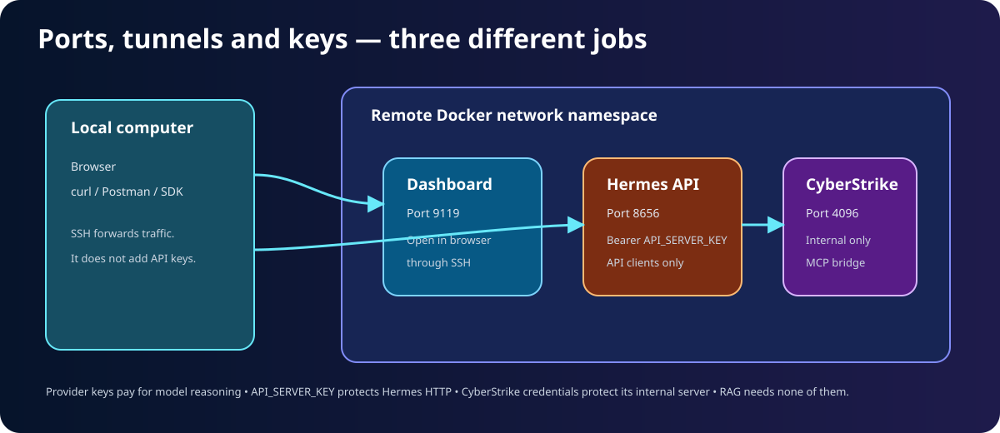
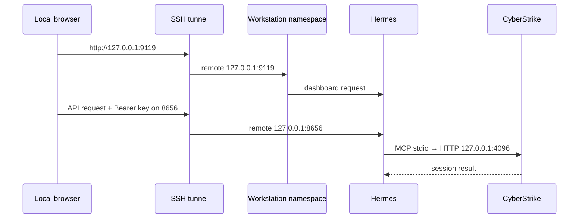
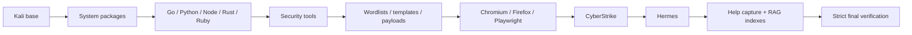

# 🧭 Architecture: Every Major Part and Connection

[← Project home](../README.md) · [Beginner guide](BEGINNERS_GUIDE.md) · [How it works](HOW_IT_WORKS.md) · [Hermes/RAG/API deep dive](HERMES_RAG_API.md)

This document explains what runs where, which files are replaceable, which data persists, and where the security boundaries actually are.


## The architecture in one sentence

One Docker image contains Kali, Hermes, CyberStrike, browsers, tools and immutable knowledge; several Compose services run that image, share carefully selected persistent host folders, and expose only the Hermes dashboard and authenticated API on host loopback.

## Three layers

### 1. Repository layer — instructions for creating the system

The Git repository is the source of truth:

```text
.
├── .env.example          safe configuration template
├── .zshrc                public shell configuration
├── Dockerfile            image recipe
├── docker-compose.yml    runtime/service recipe
├── docs/                 operator documentation
├── knowledge/            skills, guides and payload snapshots
├── scripts/              installers, startup and verification
├── tests/                source-level architecture tests
└── workspace/            ignored private/persistent data
```

The repository should contain no real credentials. `.env` and `workspace/` are deliberately ignored by Git and Docker build context.

### 2. Image layer — the replaceable appliance

The Docker image contains:

- Kali Linux and `kali-linux-headless`;
- language runtimes and security tools;
- browser engines and automation libraries;
- Hermes and CyberStrike application code;
- an immutable copy of the offensive-workstation skill;
- prebuilt local vector databases;
- installation results and resolved-version records.

Paths such as `/opt/security-tools`, `/opt/security-assets` and `/usr/local/lib/hermes-agent` are image-owned. Users should not edit them inside a running container because changes disappear when the container is replaced.

### 3. State layer — the part that survives

Compose binds host directories into the container:

| Host | Container | Contents |
|---|---|---|
| `workspace/container-opt/data` | `/opt/data` | Hermes config, memory, skills, knowledge DBs, CyberStrike state |
| `workspace/container-root` | `/root` | Root's persistent home and tool configuration |
| `workspace` | `/workspace` | Projects, target lists, scripts, notes, evidence and reports |

The image can be rebuilt and containers can be recreated without deleting these host folders.

## Compose services

All normal services use the same image, environment contract and persistent mounts.

| Service | Process | Purpose | Network behavior |
|---|---|---|---|
| `workstation` | `hermes gateway run` | Main agent gateway and authenticated API | Project bridge; publishes `127.0.0.1:8656` and `127.0.0.1:9119` |
| `dashboard` | `hermes dashboard` plus `socat` | Browser user interface | Shares the workstation's network namespace |
| `cyberstrike-api` | `cyberstrike serve` | CyberStrike sessions and agents | Shares workstation namespace; binds only `127.0.0.1:4096` |
| `setup` | `hermes setup` | Interactive initial/provider setup | Starts only with the `setup` profile |
| `malware-lab` | `zsh` | Optional isolated analysis shell | No network and no normal host binds |

### Why share one network namespace?

Inside a normal Docker bridge, `127.0.0.1` points to only one container. Sharing the workstation namespace lets Hermes, the dashboard and CyberStrike use loopback connections while keeping CyberStrike port `4096` unpublished.

The dashboard binds its real server to `127.0.0.1:9120`. A small `socat` listener exposes it as container port `9119` only to traffic arriving through the intended Docker gateway path.

## Network and port flow





Important boundaries:

- Compose publishes only to host `127.0.0.1`, never every network interface.
- SSH forwarding changes where traffic travels; it does not authenticate API requests.
- Port `4096` has no host publication.
- The workstation uses an outbound bridge/NAT network for authorized targets and provider APIs.
- The Docker socket, host PID namespace and host network are not mounted or shared.

## Startup entrypoint

Every normal service starts as root long enough to prepare its environment. [`workstation-entrypoint.sh`](../scripts/workstation-entrypoint.sh) then:

1. validates `HERMES_UID` and `HERMES_GID`;
2. adjusts the container `hermes` account to match the host owner;
3. creates writable state directories;
4. installs managed Zsh settings without replacing existing user customizations;
5. locks and synchronizes the bundled skill and both RAG indexes;
6. adds small RAG pointers to Hermes memory when space permits;
7. locks and registers the CyberStrike MCP server if absent;
8. executes the requested process as `hermes` through `gosu`.

The lock files matter because gateway, dashboard and CyberStrike may start simultaneously and all share `/opt/data`.

## Identity and privileges

The normal process runs as the dedicated `hermes` account, but Hermes has passwordless container-local `sudo`. The container also receives:

- `NET_ADMIN`
- `NET_RAW`
- `NET_BIND_SERVICE`

Nmap, Masscan, tcpdump and Naabu receive narrow file capabilities for raw network operations. Several dangerous capabilities such as `SYS_ADMIN`, `SYS_MODULE` and `SYS_RAWIO` are explicitly dropped.

> [!WARNING]
> The normal Hermes user is effectively an administrator inside the container. Docker isolation, target authorization and operator review remain the meaningful boundaries.

## Knowledge architecture

The source skill lives at:

```text
knowledge/skills/offensive-workstation-pentesting/
```

During the build:

1. installed command help is captured into Markdown;
2. skill structure and inventory coverage are validated;
3. Markdown/text sources are chunked;
4. FastEmbed generates vectors locally;
5. complete and CyberStrike-focused SQLite indexes are built and verified.

At startup, immutable sources are synchronized to:

```text
/opt/data/skills/cybersecurity/offensive-workstation/
/opt/data/knowledge/offensive-workstation/workstation-kb.sqlite3
/opt/data/knowledge/cyberstrike/cyberstrike-kb.sqlite3
```

See [Hermes, APIs and RAG](HERMES_RAG_API.md) for the detailed algorithm and customization path.

## Build dependency graph



Each installer records success/failure in `/opt/security-manifest/install-results.tsv`. Resolved versions and source revisions go to `/opt/security-manifest/resolved-versions.txt`. The final inventory gate checks every required command, path, asset and capability.

## Malware profile architecture

`malware-lab` intentionally does not inherit the normal runtime anchor. It has:

- `network_mode: none`;
- read-only root filesystem;
- all Linux capabilities dropped;
- `no-new-privileges`;
- a process limit;
- `noexec`, `nosuid`, `nodev` temporary filesystems;
- Docker-managed volumes instead of host workspace binds;
- no `.env` injection.

This is defense in depth, not a claim that arbitrary malware is safe.

## Architectural invariants

The project and tests are designed to preserve these rules:

1. No private `.env` enters Git or the Docker build context.
2. Missing required tools or assets fail the image build.
3. Browser engines must launch successfully during verification.
4. Persistent state remains outside replaceable containers.
5. CyberStrike stays internal to the shared loopback namespace.
6. Published ports stay host-local.
7. Malware analysis receives neither network access nor normal private state.
8. Knowledge indexes need no cloud embedding service.

Run [`scripts/verify-runtime.sh`](../scripts/verify-runtime.sh) to prove the runtime form rather than relying only on source inspection.
