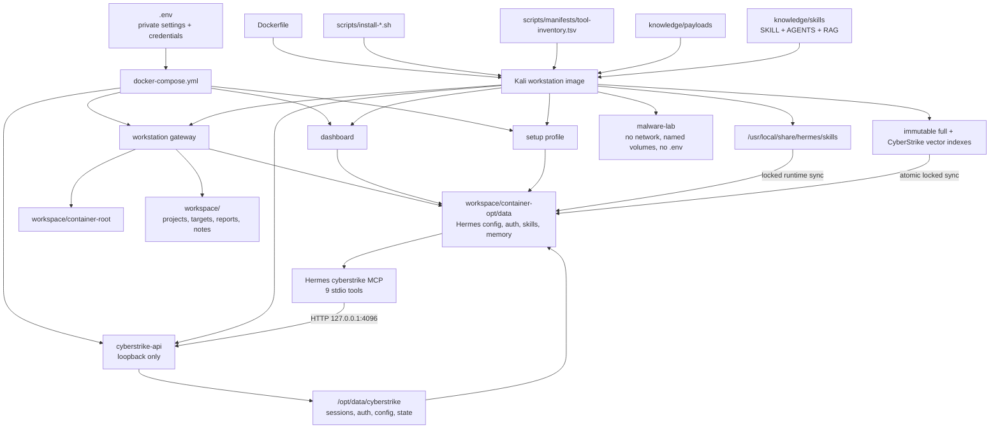

# Architecture and project map

This is the maintained project graph used to keep build inputs, runtime state,
Hermes knowledge, and private configuration logically connected.



## Repository tree

```text
.
├── .env                         private operator configuration, ignored
├── .env.example                 safe configuration template
├── .zshrc                       public managed shell configuration
├── Dockerfile                   immutable image build
├── docker-compose.yml           services, mounts, ports, isolation
├── README.md                    primary operator entry point
├── docs/                        architecture and operating guides
├── knowledge/
│   ├── skills/                  Hermes skill, AGENTS policy, RAG sources
│   └── payloads/                tracked payload snapshots
├── scripts/
│   ├── manifests/               authoritative inventory and exclusions
│   ├── lib/                     shared installer primitives
│   ├── install-*.sh             image installation stages
│   ├── configure-host.sh        creates/updates private .env and workspace
│   ├── build-and-verify.sh      build plus image smoke tests
│   ├── preflight.sh             source and safety checks
│   ├── reuse.sh                 encrypted migration
│   └── verify-runtime.sh        service and persistence audit
├── tests/                       offline architecture/Compose tests
└── workspace/                   ignored persistent and operator-created data
```

## Edit boundaries

Most frequently edited:

- `.env` for local paths, versions, ports, and credentials.
- `README.md` for the primary operator workflow.
- `Dockerfile` and `docker-compose.yml` for build/runtime behavior.

Occasionally edited:

- `knowledge/skills/` when changing Hermes guidance or RAG content.
- `scripts/manifests/tool-inventory.tsv` together with the installer that adds
  or removes a required tool.
- `docs/` when behavior changes.

Generated, persistent, or normally untouched:

- `workspace/`.
- Vendored payload material under `knowledge/payloads/`.
- Installer internals under `scripts/lib/`.

## Invariants

- No secret is committed or copied into the image.
- The image build fails if a required tool or asset is absent.
- Skill, RAG, and AGENTS material always reaches persistent Hermes `/opt/data`.
- Hermes MCP configuration and CyberStrike sessions both survive recreation.
- Normal services share intended persistence; malware analysis does not.
- Published service ports remain host-local.
