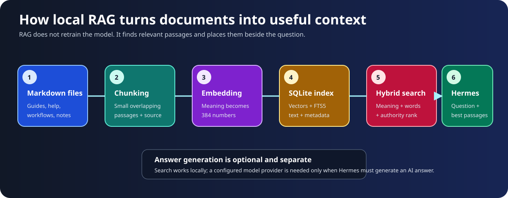

# 🧠 Optional Deep Dive: Hermes, API Keys, CyberStrike and Local RAG

[← Project home](../README.md) · [Beginner guide](BEGINNERS_GUIDE.md) · [Architecture](ARCHITECTURE.md) · [Commands](COMMANDS.md)

This chapter is optional for first use, but it answers the questions people eventually ask: Why Hermes? Where does the “intelligence” come from? What does RAG store? Which key protects which service? How do I add my own knowledge?



## Part 1: What Hermes is

Hermes Agent is the orchestration layer between you, an AI model and the workstation.

An AI model alone accepts text and produces text. It does not automatically have permission to read your files, call Nmap, remember an engagement, search private documentation or maintain a long-running session. Hermes supplies those capabilities through:

- a terminal and browser interface;
- persistent conversations and memory;
- skills containing task-specific instructions;
- local and external tools;
- model-provider selection;
- an OpenAI-compatible HTTP API;
- MCP servers for extra tool integrations;
- a gateway that keeps these pieces available as a service.

### Why use Hermes here?

Hermes is useful for this workstation because security work is not one prompt. A real assessment involves scope, discovery, tool selection, output normalization, verification and reporting. Hermes can keep that workflow together while the repository supplies strict safety guidance, a known tool inventory and local reference material.

Its power is coordination, not magical correctness. Hermes can still misunderstand intent, choose a poor command or trust a false positive. The operator remains responsible for authorization and verification.

## Part 2: Model, agent, skill, tool and memory

These words are related but not identical:

| Term | Plain meaning | Example here |
|---|---|---|
| Model | The reasoning/text engine | A configured OpenAI, Anthropic, Google, OpenRouter or Groq model |
| Agent | The program managing a multi-step task | Hermes |
| Skill | Instructions and references for a type of work | `offensive-workstation-pentesting` |
| Tool | An action the agent can invoke | Shell, browser, `workstation-kb`, CyberStrike MCP |
| Memory | Small persistent facts or pointers | `/opt/data/memories/MEMORY.md` |
| Session | One conversation and its state | Hermes or CyberStrike session records |
| RAG index | Searchable document passages | `workstation-kb.sqlite3` |

A useful mental model is:

```text
You → Hermes agent → model reasoning
                  ↘ skills and memory
                  ↘ local RAG search
                  ↘ Kali/browser tools
                  ↘ CyberStrike through MCP
```

## Part 3: What RAG is—and is not

**Retrieval-Augmented Generation** has two phases.

### Indexing phase

Documents are prepared before questions are asked:

1. discover eligible Markdown and text files;
2. split them into passages of at most roughly 1,800 characters;
3. overlap four lines between adjacent chunks so context is not cut sharply;
4. retain source path, heading and line numbers;
5. assign an authority label;
6. turn each passage into a 384-number embedding;
7. store text, metadata, keyword index and vector in SQLite.

The embedding model is `BAAI/bge-small-en-v1.5`, run locally through FastEmbed. An embedding is a numerical representation designed so passages with similar meaning sit near one another in vector space.

### Retrieval phase

When searching:

1. the question is embedded with the same model;
2. `sqlite-vec` finds nearby passage vectors using cosine distance;
3. SQLite FTS5 finds passages containing related words using BM25;
4. reciprocal-rank fusion combines semantic and keyword rankings;
5. authority weighting adjusts the fused score;
6. the top results are returned with source citations.

Current authority priorities are:

| Priority | Label | Meaning |
|---:|---|---|
| Highest | `installed-cli-help` | Captured from the actual installed executable |
| High | `curated-workstation-guidance` | Project-maintained safety/tool/workflow guidance |
| Normal | `upstream-documentation-snapshot` | Saved upstream CyberStrike documentation |
| Lower | `user-supplied-unverified` | Useful material that still needs independent confirmation |

### What RAG does not do

RAG does not:

- retrain or fine-tune the AI model;
- permanently teach a cloud provider your documents;
- prove that a retrieved passage is correct;
- grant authorization to execute a command;
- require a vector-database server or cloud embedding API.

The retrieved text is temporary context for the current reasoning step.

## Part 4: The two databases

### Complete workstation index

Command:

```bash
workstation-kb search "QUESTION" --limit 8
```

Default persistent database:

```text
/opt/data/knowledge/offensive-workstation/workstation-kb.sqlite3
```

It includes the complete skill: tool guides, workflows, safety, ethical-hacking methodologies, asset references, installed help and CyberStrike material.

### Focused CyberStrike index

Command:

```bash
cyberstrike-kb search "QUESTION" --limit 6
```

Default persistent database:

```text
/opt/data/knowledge/cyberstrike/cyberstrike-kb.sqlite3
```

It contains CyberStrike topic pages, source-library snapshots, installed help and the orchestration workflow. Its smaller scope gives better precision for CyberStrike questions.

### Inspecting database metadata

```bash
workstation-kb status
cyberstrike-kb status
workstation-kb verify
cyberstrike-kb verify
```

Status reports schema, corpus, embedding model, dimensions, source digest, file/chunk counts, creation time and SQLite versions.

## Part 5: How Hermes uses RAG

The skill tells Hermes to search before answering a pentesting question:

1. convert the user's intent into a focused retrieval query;
2. search `workstation-kb`;
3. for CyberStrike intent, also search `cyberstrike-kb`;
4. open only the highest-ranked relevant local sources;
5. prefer installed help when flags differ;
6. answer or propose a bounded workflow;
7. run active commands only after authorization requirements are satisfied.

Two compact markers are added to `MEMORY.md` so future Hermes sessions know the indexes exist. The detailed corpus stays in SQLite because Hermes memory is deliberately limited to 2,200 bytes.

## Part 6: Adding your own knowledge correctly

There are two workflows: permanent repository customization and temporary experimentation.

### Permanent, reproducible customization

Use this for organization guidance, lab manuals and references that should survive rebuilds.

1. Create a Markdown file under a suitable source folder, for example:

   ```text
   knowledge/skills/offensive-workstation-pentesting/references/my-guides/company-lab-guide.md
   ```

2. Include source and trust information near the top:

   ```markdown
   # Company Training Lab Guide

   - Owner: Security Engineering
   - Reviewed: 2026-08-01
   - Authority: internally reviewed lab procedure
   - Scope: training.example.test only
   ```

3. Use descriptive headings and self-contained paragraphs. Chunking follows text size, so clear sections improve retrieval.
4. Never add secrets, session cookies, customer data or private keys.
5. If the guide should be explicitly routed by the skill, add a concise link in `SKILL.md` or a relevant workflow/index page.
6. Validate source structure:

   ```bash
   python3 scripts/verify-knowledge-base.py
   bash scripts/preflight.sh
   ```

7. Rebuild the image so immutable skill and database copies contain the new source:

   ```bash
   bash scripts/build-and-verify.sh --cached
   sudo docker compose up -d --no-build --force-recreate
   ```

8. Verify retrieval:

   ```bash
   sudo docker compose exec workstation \
     workstation-kb search "a distinctive phrase from the new guide" --limit 5
   ```

> [!IMPORTANT]
> Editing `/opt/data/skills/...` directly is not a permanent source change. Normal startup synchronizes the image-bundled managed skill and can overwrite same-named files.

### Temporary local experiment

For a quick experiment, copy the skill to a separate path under `/workspace`, add documents there, and build a separate database:

```bash
cp -a /opt/data/skills/cybersecurity/offensive-workstation \
  /workspace/config/experimental-skill

mkdir -p /workspace/config/experimental-skill/references/custom
nano /workspace/config/experimental-skill/references/custom/my-note.md

workstation-kb \
  --database /workspace/config/experimental-kb.sqlite3 \
  index --skill-root /workspace/config/experimental-skill

workstation-kb \
  --database /workspace/config/experimental-kb.sqlite3 \
  search "my test topic" --limit 5
```

This does not replace the default Hermes index. It is useful for measuring retrieval quality before committing a source change.

### Writing documents that retrieve well

- Put one main subject in each file.
- Use real headings rather than one giant paragraph.
- Repeat important product names naturally in the relevant section.
- Define acronyms on first use.
- State prerequisites, scope and failure conditions.
- Include exact installed commands only after verification.
- Prefer short examples followed by explanation.
- Mark uncertain or unverified content explicitly.
- Remove duplicates; identical normalized chunks are deduplicated.

### “How do I input knowledge into the model?”

You normally do **not** upload it to the model. Add documents to the skill, rebuild the index, retrieve passages, and let Hermes place those passages in the model's context for the current question.

If you require model fine-tuning, that is a separate project with different data preparation, privacy, cost and evaluation requirements. This repository implements RAG, not fine-tuning.

## Part 7: Ports, tunnels and authentication


### Local bindings

Compose publishes:

```text
127.0.0.1:9119 → dashboard
127.0.0.1:8656 → Hermes API
```

The `127.0.0.1` bind means only the Docker host itself can connect directly. This is safer than publishing on `0.0.0.0`.

### Remote access through SSH

Run on the local computer:

```bash
ssh -N \
  -L 9119:127.0.0.1:9119 \
  -L 8656:127.0.0.1:8656 \
  USER@SERVER_IP
```

This produces two new local listeners. Traffic entering local port `9119` or `8656` travels encrypted through SSH to the corresponding remote loopback port.

SSH proves access to the server. It does not provide HTTP API authentication.

## Part 8: Four kinds of secrets

| Secret | Protects/enables | Sent to | Needed for local RAG? |
|---|---|---|---:|
| `API_SERVER_KEY` | Hermes HTTP API on `8656` | Hermes gateway | No |
| Provider API key | Model-generated reasoning/replies | Selected model provider | No |
| `CYBERSTRIKE_SERVER_PASSWORD` | Optional CyberStrike server authentication | Internal CyberStrike service | No |
| Tool-specific key | Shodan, Censys, VirusTotal, Interactsh, etc. | That specific service | No |

These keys are not interchangeable.

### Hermes `API_SERVER_KEY`

`scripts/configure-host.sh` generates a random key and saves it in private `.env`. Compose injects it into the gateway. Clients send:

```http
Authorization: Bearer <API_SERVER_KEY>
```

The key authenticates the client to Hermes; it does not pay for model usage and is not sent to an AI provider.

### CyberStrike credentials

CyberStrike listens only on internal loopback port `4096`. `CYBERSTRIKE_SERVER_USERNAME` defaults to `cyberstrike`. If a password is explicitly configured, normal services receive the same value and the MCP bridge can use HTTP Basic authentication.

If the password is blank, the CyberStrike service creates a random process-only value at startup. It is neither printed nor stored. Port `4096` remains internal regardless.

### Provider keys

Provider credentials allow a selected model service to generate replies. They may be available to both Hermes and CyberStrike because both can use models. Configure only providers you actually use.

### Vector database authentication

There is none. The RAG databases are local SQLite files protected by filesystem permissions and container/host access. They do not listen on a network port.

## Part 9: Testing the Hermes API

On the Docker host, load the key from `.env` without typing it into command history:

```bash
export API_SERVER_KEY="$(sed -n 's/^API_SERVER_KEY=//p' .env | tr -d '\r\n')"
```

Then:

```bash
curl -sS \
  -H "Authorization: Bearer ${API_SERVER_KEY}" \
  http://127.0.0.1:8656/v1/models | jq
```

From a local computer, first create the SSH tunnel and then set the same key locally.

For Bash interactive entry:

```bash
read -rsp "API key: " API_SERVER_KEY
echo
export API_SERVER_KEY
```

For Zsh interactive entry:

```zsh
read -rs 'API_SERVER_KEY?API key: '
echo
export API_SERVER_KEY
```

Do not put the actual key inside the prompt string. After `read` displays `API key:`, paste the key invisibly and press Enter.

### Why the browser address bar returns 401

Opening this:

```text
http://127.0.0.1:8656/v1/models
```

does not add an `Authorization` header. The expected response is therefore:

```json
{
  "error": {
    "message": "Invalid gateway API key (API_SERVER_KEY)",
    "code": "gateway_auth_failed"
  }
}
```

That error proves the tunnel and API are reachable. Use port `9119` in a browser and port `8656` with `curl`, Postman, Bruno or an SDK.

### OpenAI-compatible client settings

```text
Base URL: http://127.0.0.1:8656/v1
API key:  <API_SERVER_KEY>
Model:    hermes-agent
```

## Part 10: Rotating the Hermes API key

Rotate the key if it appears in chat, logs, screenshots, shell history or an untrusted machine.

1. Generate a new 64-character hex value:

   ```bash
   openssl rand -hex 32
   ```

2. Replace the single `API_SERVER_KEY=` value in `.env` without committing it.
3. Keep `.env` mode `600`:

   ```bash
   chmod 600 .env
   ```

4. Recreate services so processes receive the new environment:

   ```bash
   sudo docker compose up -d --no-build --force-recreate
   ```

5. Update legitimate API clients and remove the old key from local variables:

   ```bash
   unset API_SERVER_KEY
   ```

## Part 11: Troubleshooting the data paths

Check the skill and databases inside the container:

```bash
test -s /opt/data/skills/cybersecurity/offensive-workstation/SKILL.md
ls -lh /opt/data/knowledge/offensive-workstation/workstation-kb.sqlite3
ls -lh /opt/data/knowledge/cyberstrike/cyberstrike-kb.sqlite3
workstation-kb verify
cyberstrike-kb verify
```

Check MCP registration and service health:

```bash
hermes mcp list
hermes mcp test cyberstrike
curl -fsS http://127.0.0.1:4096/global/health | jq
```

Check knowledge structure:

```bash
check-knowledge --require-help
```

If a result is irrelevant, first improve headings and source text, then rebuild and test with several realistic queries. Do not judge retrieval from one carefully copied phrase alone.

## The shortest correct summary

> Hermes coordinates the work. A provider model supplies optional reasoning. Skills supply rules. RAG locally retrieves relevant documents. The Hermes API key protects external API calls. CyberStrike is an internal specialist reached through MCP. The vector databases are local files and need no API key.
