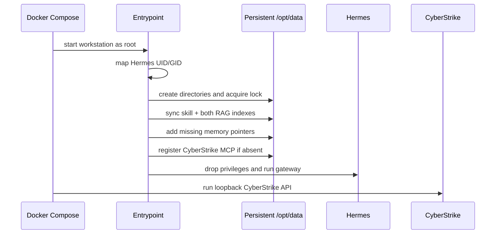

# ⚙️ How It Works: Build, Startup and Request Lifecycles

[← Project home](../README.md) · [Beginner guide](BEGINNERS_GUIDE.md) · [Architecture](ARCHITECTURE.md) · [Hermes/RAG/API deep dive](HERMES_RAG_API.md)

This chapter follows the system through time: what happens during a build, when containers start, when you ask Hermes a question, and when you recreate or migrate the workstation.

## Lifecycle 1: Host preparation

You run:

```bash
bash scripts/configure-host.sh
```

The script:

1. finds the current host user's numeric UID and GID;
2. creates the persistent workspace folders;
3. reads existing settings so rerunning it does not erase configured credentials;
4. migrates supported values from older configuration locations when present;
5. generates a 64-character random `API_SERVER_KEY` if missing;
6. atomically writes `.env` with mode `600`.

Docker Compose uses `.env` twice: first for `${VARIABLE}` substitutions in YAML, and second as the environment injected into normal services.

## Lifecycle 2: Image build

You run:

```bash
bash scripts/build-and-verify.sh
```

### Preflight

Before downloading anything, the build wrapper checks:

- `.env` exists, is private and has a usable API key;
- Git/Docker ignore rules protect private files;
- shell and Python syntax;
- Compose architecture and isolation rules;
- tool inventory shape and backwards-compatible command coverage;
- knowledge-guide completeness and links;
- Docker, Compose and engine access.

### Kali foundation

Docker pulls the configured `kalilinux/kali-last-release` base. The first installer confirms the expected Kali APT repository track, performs a full upgrade and installs `kali-linux-headless`.

A `hermes` user is created with UID/GID `10000` as an image default. Runtime startup later changes those IDs to match the host.

### Toolchain stages

The image installs tools in separate layers so failures are easier to locate and successful layers can be cached:

1. system and Zsh environment;
2. Kali network packages;
3. official Go archive;
4. isolated Python security environment;
5. isolated RAG Python environment;
6. checksummed official Node.js and current npm;
7. Rust and Ruby tools;
8. release binaries and source-built utilities;
9. compatibility wrappers for legacy command names;
10. wordlists, templates, patterns and payload repositories;
11. browser automation;
12. CyberStrike;
13. Hermes.

The shared installer library runs each required step in an errexit-enabled subshell. It records every result and fails the layer after reporting all failed steps in that ecosystem.

### Browsers

Playwright installs both Chromium and Firefox into a shared immutable browser directory. The build verifies:

- the Playwright CLI;
- agent-browser help and client/daemon launch;
- direct Chromium headless rendering;
- Chromium and Firefox through the Playwright API;
- the exact paths Hermes will discover later.

### CyberStrike

The installer uses the official npm release and architecture-specific native package. Registry integrity metadata is retained. CyberStrike also receives a dedicated Node 24 runtime because its pinned Playwright version may differ from the workstation's latest Node runtime.

A wrapper redirects CyberStrike XDG data/config/cache/state into persistent `/opt/data/cyberstrike`, seeds bundled web/skill resources once, and links the matching HackBrowser worker and Playwright packages.

### Hermes

The installer resolves the latest stable Hermes release tag, fetches the official installer from that exact Git object, verifies its Git blob hash, and installs Hermes into `/usr/local/lib/hermes-agent`.

The dashboard is built during image creation so runtime startup never needs to modify immutable application code.

### Knowledge generation

Installed `--help` output is captured and sanitized. The complete and focused knowledge corpora are embedded locally and written to immutable SQLite databases. Structural and database verification gates run before the image is finalized.

### Final image gate

The authoritative inventory verifies commands, paths, non-empty assets and Linux file capabilities. The image is cleaned of build-time caches, receives its entrypoint and a periodic health check, and is then tested again in short-lived containers by `build-and-verify.sh`.

## Lifecycle 3: Compose startup

You run:

```bash
sudo docker compose up -d --no-build
```

Compose creates one project bridge and starts the workstation, dashboard and CyberStrike services.



The entrypoint is idempotent: running it again refreshes managed files, preserves unrelated user state and avoids duplicate memory/MCP entries.

## Lifecycle 4: A question to Hermes

Suppose you ask:

```text
How should I safely discover routes in an API I own?
```

The intended agent workflow is:

1. Hermes recognizes the offensive-workstation skill.
2. The skill requires written scope and authorization before active testing.
3. Hermes runs a local `workstation-kb` search for the intent.
4. Hybrid retrieval returns relevant passages from curated workflows, tool guides and installed help.
5. Hermes reads only the most relevant sources.
6. A configured model reasons over your question plus retrieved passages.
7. Hermes explains a bounded plan and, when authorized, can invoke tools.
8. Raw results and evidence go under `/workspace/reports/<engagement>`.

The retrieval program does not authorize execution. Safety policy and explicit user scope remain controlling.

## Lifecycle 5: A CyberStrike session

For live CyberStrike work:

1. Hermes starts the bundled MCP bridge over standard input/output.
2. The bridge validates session IDs, limits, message sizes and workspace paths.
3. It rejects remote CyberStrike URLs unless explicitly overridden.
4. It calls verified HTTP routes at `127.0.0.1:4096`.
5. CyberStrike stores session state below `/opt/data/cyberstrike`.
6. The MCP result returns to Hermes as structured tool output.

There are nine MCP tools: health, list/create/get/delete session, get/send messages, status and abort. Deletion requires `confirm=true`.

RAG and MCP are different paths: RAG retrieves documentation; MCP controls live sessions.

## Lifecycle 6: API request

An API client sends:

```http
GET /v1/models HTTP/1.1
Host: 127.0.0.1:8656
Authorization: Bearer <API_SERVER_KEY>
```

The gateway compares the bearer token with its injected `API_SERVER_KEY`. A browser address bar cannot add that header, so directly browsing to the endpoint returns a deliberate `401` authentication error.

The API is OpenAI-compatible, meaning many clients can use:

```text
Base URL: http://127.0.0.1:8656/v1
API key:  the API_SERVER_KEY value
Model:    hermes-agent
```

## Lifecycle 7: Recreate, update and stop

When `.env` changes, recreate containers so they receive the new environment:

```bash
sudo docker compose up -d --no-build --force-recreate
```

When repository build inputs change, rebuild the image:

```bash
git pull origin main
bash scripts/build-and-verify.sh --cached
sudo docker compose up -d --no-build --force-recreate
```

Stopping normally:

```bash
sudo docker compose down
```

does not remove bind-mounted state. Docker-managed malware volumes also remain unless explicitly removed.

## Lifecycle 8: Backup and migration

The encrypted reuse workflow stops changing services, checks that containers use the expected mounts, saves the image, archives private state and runtime files, creates SHA-256 manifests, restarts previous services, and encrypts the package using GPG AES-256.

See [Backup and migration](REUSE.md). Treat the resulting bundle like a copy of the entire workstation: it may contain provider keys, authenticated sessions, target information and reports.

## Failure philosophy

This project prefers a failed build over a silently incomplete security workstation. A green package download is not enough; tools must resolve, browser engines must launch, collections must be substantive, indexes must pass integrity checks, and persistence/network assumptions must be proven separately at runtime.
