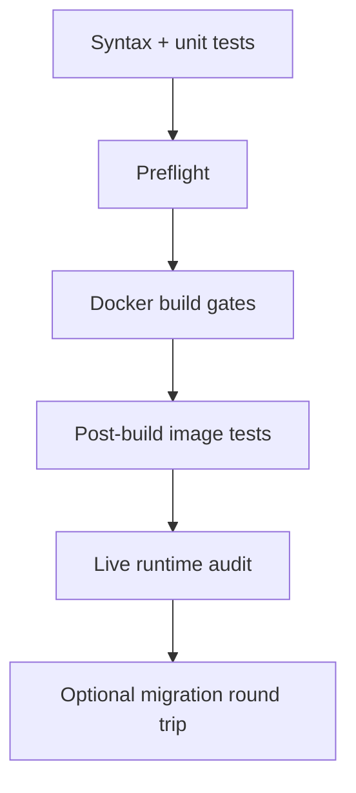

# ✅ Implementation and Verification Guide

[← Project home](../README.md) · [Architecture](ARCHITECTURE.md) · [Commands](COMMANDS.md)

This page explains what the project checks, what each successful check proves, and what it cannot prove.

## Verification ladder



Each level depends on more real runtime behavior than the one above it.

## Level 1: Offline tests

```bash
bash scripts/unit-test.sh
```

Checks:

- every shell script parses;
- `.zshrc` parses when Zsh is installed;
- Compose YAML anchors and merged service contracts;
- Python source parses;
- architecture tests covering base image, identity, ports, mounts, isolation, browser wiring, RAG, MCP and reuse;
- knowledge guide coverage and local links;
- whitespace errors in Git diffs.

It does not download tools or start Docker.

## Level 2: Preflight

```bash
bash scripts/preflight.sh
```

Adds checks for:

- private `.env` permissions and API key length;
- portable mount defaults;
- absence of obsolete split configuration files;
- Git/Docker ignore protection;
- tool inventory shape and duplicate entries;
- vendored payload snapshots;
- Dockerfile connection to every required installer;
- secret-like values in public/build files;
- bridge networking, loopback publication and malware isolation.

Require a usable Docker engine too:

```bash
bash scripts/preflight.sh --require-docker
```

## Level 3: Docker build gates

The Dockerfile itself requires:

- official Kali release-track validation and `kali-linux-headless`;
- successful installer stages;
- checksummed Node archives and verified npm/package integrity where supported;
- successful command smoke tests;
- substantive asset collection sizes and expected structures;
- successful direct and Playwright browser launches;
- generated installed-help pages;
- valid complete and CyberStrike vector indexes;
- every authoritative inventory command, path, asset and capability.

If a required component fails, the image is not finalized.

## Level 4: Post-build image audit

```bash
bash scripts/build-and-verify.sh --verify-only
```

Short-lived containers prove:

- the entrypoint and normal Hermes identity work;
- container-local sudo works;
- all inventory checks pass as Hermes;
- skill synchronization, memory pointers and both RAG searches work;
- isolated Python environments pass `pip check`;
- Kali, Hermes and CyberStrike report usable versions;
- Zsh works for root and Hermes;
- agent-browser, Chromium and Firefox launch successfully.

## Level 5: Live runtime audit

```bash
bash scripts/verify-runtime.sh --recreate
```

This inspects actual Compose containers and proves:

- expected host bind sources;
- one outbound project bridge;
- no privileged mode or Docker socket;
- host-loopback-only `8656` and `9119`;
- unpublished CyberStrike `4096`;
- Hermes API rejects unauthenticated requests and accepts the configured key;
- dashboard and CyberStrike health;
- root/Hermes Zsh and container-local administration;
- complete tool, knowledge and browser checks;
- nine CyberStrike MCP tools and a no-model session round trip;
- state survives forced container recreation.

## Level 6: Migration test

```bash
bash scripts/verify-runtime.sh --recreate --reuse-roundtrip
```

Additionally verifies dependency rejection, mount protection, encrypted export, checksum verification and isolated import.

## Current requirement mapping

| Requirement | Implementation |
|---|---|
| Direct stable Kali base | `kalilinux/kali-last-release` plus `kali-linux-headless` |
| Hermes on Kali | Stable release installed under `/usr/local/lib/hermes-agent` |
| Persistent skills/RAG/memory | Locked entrypoint sync into bind-mounted `/opt/data` |
| One private configuration | Ignored, mode-`600` root `.env` |
| Authenticated Hermes API | Bearer-protected `8656`, host-loopback publication |
| Internal CyberStrike | Shared loopback namespace, no publication of `4096` |
| Browser automation | agent-browser plus Playwright Chromium and Firefox |
| Tool completeness | Authoritative 3-column inventory and strict verifier |
| Malware isolation | No network, no `.env`, no normal host binds, read-only root |
| Portable private reuse | GPG-encrypted image/state/config bundle with checksums |

## What passing checks cannot guarantee

- An upstream download will remain available tomorrow.
- Floating `latest` releases will produce bit-identical future images.
- Every third-party tool is vulnerability-free.
- An AI-generated command is correct or authorized.
- A scanner finding is a true vulnerability.
- Container isolation is equivalent to a disposable virtual machine for hostile malware.

The verification system establishes a strong runtime contract, not absolute security or eternal reproducibility.
